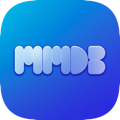
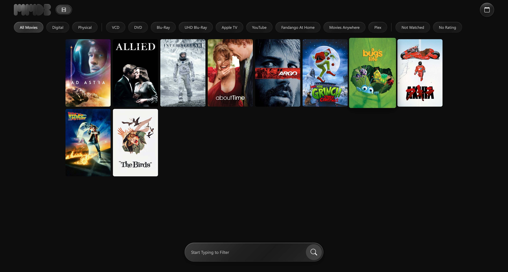
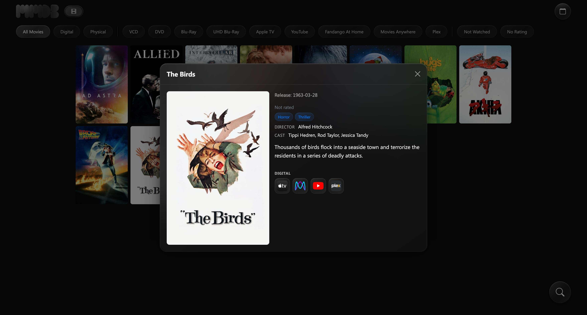
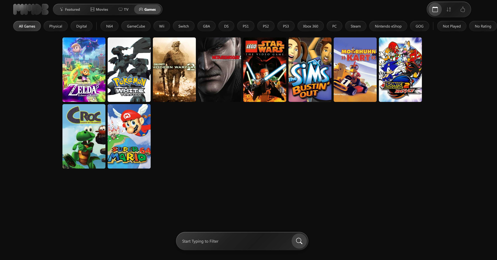
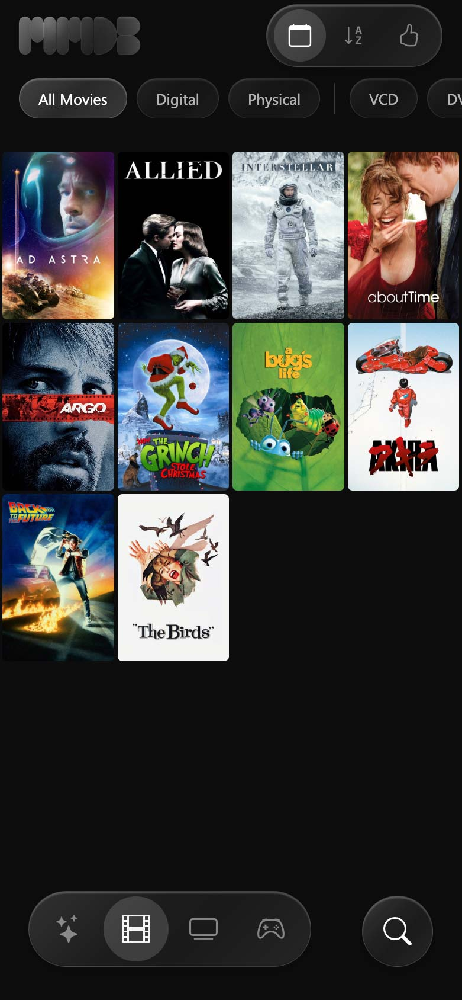

# My Media DB

A self-hosted personal media collection tracker — catalog your physical and digital library of movies, TV shows, and games in one place.





## Features

- Browse movies, TV shows, and games in a clean poster grid
- Featured section to highlight picks from your collection
- Detail view with poster, rating, genres, credits, and format badges
- Filter by format, platform, genre, or custom tags
- Sort by date added, A–Z, or rating
- Full-text search across your entire library
- Physical and digital format support (DVD, Blu-Ray, UHD, Apple TV, Plex, and more)
- Multi-platform game support (PlayStation, Nintendo, Xbox, PC, and more)
- Import scripts for Letterboxd, Plex, Fandango At Home, and Apple TV libraries
- Installable as a PWA — works on desktop and mobile
- No server-side code required

## Quick Start

1. Download or clone the repository
2. Copy `data/config.example.json` to `data/config.json` and add your API keys
3. Add your movies, TV shows, and games to the JSON files in `data/`
4. Upload to any web server or open locally in a browser

## Setup Requirements

- A web server or local development environment (or simply open `index.html` directly)
- Modern web browser
- API keys for metadata lookup (optional but recommended):
  - [TMDB](https://www.themoviedb.org/settings/api) — movies and TV shows
  - [RAWG](https://rawg.io/apidocs) — games (alternative)
  - [IGDB](https://api-docs.igdb.com/) — games (alternative)

## Configuration

Edit `data/config.json` to set your preferences:

```json
{
  "posterMode": "remote",
  "coverMode": "remote",
  "tmdbImageBase": "https://image.tmdb.org/t/p/w500",
  "featured": true,
  "modes": ["movies", "tv", "games"],
  "defaultMode": "movies",
  "gameApi": "igdb",

  "tmdbApiKey": "YOUR_TMDB_API_KEY_HERE",
  "rawgApiKey": "YOUR_RAWG_API_KEY_HERE",
  "igdbClientId": "YOUR_IGDB_CLIENT_ID_HERE",
  "igdbClientSecret": "YOUR_IGDB_CLIENT_SECRET_HERE"
}
```

| Key | Description |
|---|---|
| `posterMode` | `"remote"` uses TMDB URLs; `"local"` uses files in `posters/` |
| `coverMode` | `"remote"` uses IGDB/RAWG URLs; `"local"` uses files in `covers/` |
| `featured` | Enable or disable the Featured section |
| `modes` | Which sections to show: `movies`, `tv`, `games` |
| `defaultMode` | Which section loads first |
| `gameApi` | `"igdb"` or `"rawg"` |

## Import Scripts

Populate your library quickly using the included import scripts in `scripts/`:

| Script | Source |
|---|---|
| `import-letterboxd-ratings.mjs` | Letterboxd ratings export CSV |
| `import-plex.mjs` | Plex Media Server library |
| `import-fandango.mjs` | Fandango At Home purchase history |
| `import-appletv.mjs` | Apple TV purchase history |
| `import-html.mjs` | Generic HTML page import |

## Mobile



My Media DB is installable as a Progressive Web App (PWA) on iOS and Android. Add it to your home screen from your browser for a native-app experience.

## Browser Support

- Chrome / Brave (recommended)
- Safari
- Firefox
- Edge

## Contributing

Contributions are welcome! Feel free to submit a Pull Request.

## License

This project is licensed under the MIT License — see the LICENSE file for details.

---

Built with:
- [Bootstrap 5](https://getbootstrap.com)
- [Bootstrap Icons](https://icons.getbootstrap.com)
- [TMDB API](https://www.themoviedb.org/documentation/api)
